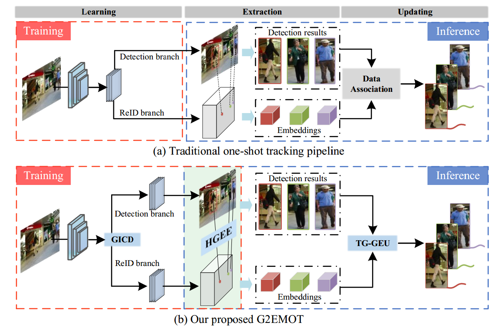

# G2EMOT
>[**G2EMOT: Guided Embedding Enhancement for Multiple Object Tracking in Complex Scenes**](https://ieeexplore.ieee.org/document/10653748)
</br>
> Accept by  IEEE Transactions on Instrumentation and Measurement (TIM)

## 🚩 Abstract
The one-shot multiple object tracking framework simultaneously generates detected 
targets and re-identification (ReID) embeddings, and employs them to associate previous 
tracks. However, the continuity between the learning and extraction within the ReID task 
is unconsciously neglected because of treating them as two isolated stages. This leads to 
unreliable ReID embeddings and poses a challenge to target matching especially in complex 
and crowded scenarios. To this end, we propose a guided embedding enhancement multiple object 
tracker, named G2EMOT. It consists of three innovative designs aiming at improving the embedding 
representation capability for individual targets. First, based on the original feature map, 
a global instance-specific context decoupling (GICD) module is devised to facilitate the 
respective feature learning for detection and ReID branches. Then, a heatmap guided 
embedding enhancement (HGEE) module is introduced to connect the processes of embedding 
learning and extraction, ensuring that the detected target coordinates are accurately 
aligned with the discriminative ReID embeddings. Finally, to associate and stabilize 
matched targets, we present a novel two-gate guided embedding update (TG-GEU) strategy 
that dynamically updates ReID embeddings. With the proposed three components, G2EMOT achieves 
outstanding performance on popular MOT benchmarks, while outperforming the existing one-shot 
tracking methods by a large margin. In particular, it realizes IDF1 of 76.1% on MOT17 and IDF1 
of 74.2% on MOT20. 

## 🗼 Pipeline of STCMOT


## 💁 Get Started

### Environment preparation

```
git clone https://github.com/ydhcg-BoBo/G2EMOT.git
```

```
conda create -n G2EMOT python=3.8
conda activate G2EMOT
# Note: GPU 3090 for cuda 11.0
pip install torch==1.7.1+cu110 torchvision==0.8.2+cu110 torchaudio==0.7.2 -f https://download.pytorch.org/whl/torch_stable.htm
cd ${STCMOT_ROOT}
pip install cython
pip install -r requirements.txt
```

* We use [DCNv2_pytorch_1.7](https://github.com/ifzhang/DCNv2/tree/pytorch_1.7) following [FairMOT](http://arxiv.org/abs/2004.01888)
```
git clone -b pytorch_1.7 https://github.com/ifzhang/DCNv2.git
cd DCNv2
./make.sh
```

### Data preparation
* You can follow  [FairMOT](http://arxiv.org/abs/2004.01888) to prepare your datasets.


## Training
* Download the training data
* Change the dataset root directory 'root' in src/lib/cfg/data.json and 'data_dir' in src/lib/opts.py
* Pretrain on CrowdHuman and train on MIX:
```
sh experiments/crowdhuman_dla34.sh
sh experiments/mix_ft_ch_dla34.sh
```
* Only train on MIX:
```
sh experiments/mix_dla34.sh
```
* Only train on MOT17:
```
sh experiments/mot17_dla34.sh
```

* Train on MOT20:
The data annotation of MOT20 is a little different from MOT17, the coordinates of the bounding boxes are all inside the image, so we need to uncomment line 313 to 316 in the dataset file src/lib/datasets/dataset/jde.py:
```
#np.clip(xy[:, 0], 0, width, out=xy[:, 0])
#np.clip(xy[:, 2], 0, width, out=xy[:, 2])
#np.clip(xy[:, 1], 0, height, out=xy[:, 1])
#np.clip(xy[:, 3], 0, height, out=xy[:, 3])
```
Then, we can train on the mix dataset and finetune on MOT20:
```
sh experiments/crowdhuman_dla34.sh
sh experiments/mix_ft_ch_dla34.sh
sh experiments/mot20_ft_mix_dla34.sh
```

## Tracking
```
sh track.sh
```

### Acknowledgement
A large part of the code is borrowed from [Fairmot](https://github.com/ifzhang/FairMOT).
Thanks for their wonderful works.

## Citation

```
@ARTICLE{10653748,
  author={Ma, Jianbo and Wu, Fei and Li, Chunjiang and Tang, Chuanming and Zhang, Jianlin and Xu, Zhiyong and Li, Meihui and Liu, Dongxu},
  journal={IEEE Transactions on Instrumentation and Measurement}, 
  title={G2EMOT: Guided Embedding Enhancement for Multiple Object Tracking in Complex Scenes}, 
  year={2024},
  volume={},
  number={},
  pages={1-1},
  keywords={Multiple object tracking;one-shot tracker;embedding learning;track association},
  doi={10.1109/TIM.2024.3449952}}
```

